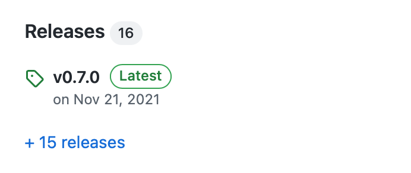

# node-releaser
Automated versioning and package publishing tool. Supports [semver](https://semver.org) and [calver](https://calver.org). Extendible with plugins.


[](https://badge.fury.io/js/node-releaser)


It is simply: `releaser patch -m "commit message"` and you get this: 

## Introduction
`releaser` is based on `git` and `node.js`. Any developer who works with `git` can use it to automate releasing and publishing process of any project. Here is a summary of what can be done with releaser:
1. Use [semver](https://github.com/npm/node-semver) or [calver](https://github.com/muratgozel/node-calver) in your project. New versions computed automatically as you release. This feature based on git tags.
2. It works in sync with the remote code repositories. Supported git services are **Github** and **Gitlab** as you can see in the `src/plugins` folder.
3. Automated **npm** package management. New releases automatically be pushed to npm and updates the version field in package.json file.
4. Automated docker image publishing. It builds the image with new version number and `latest` tags and push it to docker hub or any other docker image registry.
5. Powerful configuration management thanks to [convict](https://github.com/mozilla/node-convict/tree/master/packages/convict). Configuration can be load from a file, env vars and cli args at the same time.
6. Extendible through plugins. You can write a changelog plugin for example that pushes commit messages to a changelog file as you release.
7. All of the above are optional and can be configured.

## Install
Install it globally:
```sh
npm i -g node-releaser
```

## Usage (CLI)
Make sure `releaser` is available:
```sh
releaser --version
```

Without a configuration, **releaser** auto-detects if your repository hosted on **Github** or **Gitlab** and automatically enables releasing. It also detects **package.json** and enables updating version field. Other defaults are versioning scheme and version prefix which are **semver** and **v** by default.

✅ For auto releasing on **Github** or **Gitlab** to work, you need to set one of the `GITHUB_TOKEN` or `GITLAB_TOKEN` environment variables. These are personal access tokens that you can create on those services if you haven't yet.

Let's say you have a project hosted on **Github** and has **package.json**. As initial commit you would do:
```sh
releaser premajor.beta -m "my initial commit"
```
and releaser would create a version tag **v1.0.0-beta.0**, a release on **Github** and update the version field of **package.json** to v1.0.0-beta.0. This goes on in the same way in the next commits:
```sh
releaser beta -m "updated this" -m "updated that" # v1.0.0-beta.1
releaser major -m "msg" # v1.0.0
```

### More Control With A Configuration File
There are two places to configure the releaser. First one is `releaser.json` file and the second one is `releaser` property inside `package.json`.

Let's say I have a Github project with package.json and I don't want to prefix versions with `v` and I don't want Github releases. In this case, I would create `releaser.json` with the following:

```json
{
  "versioning": {
    "prefix": ""
  },
  "github": {
    "enable": true,
    "release": true
  }
}
```

We could have just set `enable: false` for `github` to completely disable it. Just disabled `release` since there could be other Github features one can use)

Similarly, we can play with `npm` features:

```json
{
  "npm": {
    "enable": true,
    "updatePkgJson": true,
    "publish": true,
    "publishCmdSuffix": "--access=public"
  }
}
```

In the example above, we tell releaser to update version field in package.json, publish package to the npm and add a command line flag to the publish command. It becomes `npm publish --access=public`. If we set `enable` to `false` then none of these happen.

### Configuration Schema
Releaser has many configuration options. You can browse them [here](src/config/schema.js).

### Example With Calendar Versioning
Releaser works seamlessly with `calver` as well. To configure releaser to use `calver` instead of `semver`:
```json
{
  "versioning": {
    "scheme": "calver",
    "format": "yyyy.mm.minor"
  }
}
```
The property `format` is specific to `calver` and you can look at [here](https://github.com/muratgozel/node-calver) to get more information about it.

As an example, you would do:
```sh
releaser calendar.beta -m "my initial commit" # v2021.1.0-beta.0 (assuming current date is 2021.1)
releaser beta -m "updated this" -m "updated that" # v2021.1.0-beta.1
releaser calendar -m "msg" # v2021.1.0
```

### Command Line Flags
The level of the commit must be specified as the first argument. Like `major`, `beta`, etc. You can view the list of available levels by executing help command:
```sh
releaser --help
```
Some of them applies to semver, some to calver and some to both.

To ignore the searching for the current version in git history you can specify it to calculate the next version:
```sh
releaser major -m "initial release." --current-tag v3.0.0
```

## Default Plugins
1. **Github**: Github plugin is for creating releases on Github.
2. **Gitlab**: Gitlab plugin is for creating releases on Gitlab.
3. **npm**: Npm plugin can keep the version field in package.json up to date and responsible for publishing packages thorugh npm.
4. **Docker**: Docker plugin is for building and pushing docker images to some container registry.
5. **cmd**: Command plugin is for executing shell commands before or after running pushing code changes to the remote.

## Plugin Development
A template for a plugin:
```js
function myplugin() {
  async function initiated() {
    // triggered when config is ready
  }

  async function beforePush(nextTag) {
    // triggered when the next version computed
  }

  async function afterPush(tag, changelog) {
    // triggered when after git push
  }

  return {
    initiated: initiated,
    beforePush: beforePush,
    afterPush: afterPush
  }
}

module.exports = myplugin()
```
This is a minimal setup. All methods have the same special context which is accessible with `this`:
```js
async function beforePush(nextTag) {
  // triggered when the next version computed

  // context:
  console.log(
    // you can access all config props. this.config.get('github.token') for example
    this.config,
    // a function that returns unprefixed version number. Without "v" for example.
    this.getBareVersion,
    // a function that return prefixed version number.
    this.prefixTag,
    // an object which reads repository data and has some methods. refer to src/modules/git
    this.git,
    // an object that has one method which is generateNextTag
    this.versioning
  )
}
```

### Activating Plugin
Enable and specify the path of the plugin in `.releaser.json`:
```json
{
  "myplugin": {
    "enable": true,
    "path": "./devops/releaser-plugins/myplugin.js",
    "someOtherOption": "yes"
  }
}
```
Run the releaser as usual, that's all.

---

Version management of this repository done by [releaser](https://github.com/muratgozel/node-releaser) 🚀

---

Thanks for watching 🐬

[](https://ko-fi.com/F1F1RFO7)
