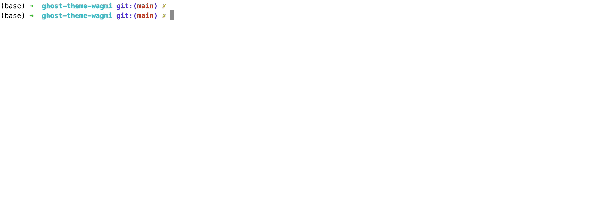

# node-releaser
Software versioning, releasing and publishing tool.


[](https://badge.fury.io/js/node-releaser)

## Features
1. Supports [semver](https://semver.org) and [calver](https://calver.org) based versioning.
2. Auto-create Github/Gitlab releases.
3. Auto-manage package.json's version field and optional npm publish option.
4. Auto-publishes your docker containers as you release.
5. Interactive cli with `--non-interactive` option.


## Install
```sh
# install globally
npm i -g node-releaser
# or locally
npm i node-releaser 
```

## Use
```sh
# if you installed globally
releaser [command] [options]
# or locally
npx releaser [command] [options]
```

## Quickstart
In any git based project, run:
```sh
releaser release -l patch -m "fix: something" -m "feat: a new feature."
```
This command validates your codebase first, runs interactive configuration wizard if there is no configuration defined, commit+tag+push your changes and calls relevant hooks while doing all of this.



It checks project's git history, git remotes, package.json and Dockerfile to offer you the essential functionality such as generating next versions, publishing npm package versions, creating releases on Github or Gitlab, pushing container images to a docker registry.

All features can be enabled/disabled through a configuration file. It is either `.releaser.json` or `releaser` property inside `package.json`. Interactive configuration wizard will help you to create this configuration and you can edit anytime as you wish.

For releasing on Github or Gitlab to work, the `GITHUB_TOKEN` or `GITLAB_TOKEN` environment variables has to be set. These are personal access tokens that you can create from their website.

## Example Scenario: npm Packages
Let's say you are making a node.js module to help devs in some way and you decided to host it on Github and serve via npm.

On initial release you would do:
```sh
releaser release -l premajor.beta -m "initial release."
```
This command will show you the interactive configuration wizard and after configuration, it commits your changes, creates a git tag **v1.0.0-beta.0**, creates a release on Github and publishes your package on npm, in a default configuration behaviour.

You would do a few more beta updates and eventually release the major release:
```sh
releaser release -l beta -m "another beta release." # v1.0.0-beta.1
releaser release -l major -m "major release!" # v1.0.0
```

## Example Scenario: Frontend App
In this scenario, we are making frontend web application and want to use calendar versioning instead of semver. Our code hosted on Gitlab and we have a package.json.

In the first call for releaser, you will face the configuration wizard and this time we choose calver as versioning scheme instead of semver. The call is pretty much same with only `level` difference.
```sh
releaser release -l calendar.beta -m "initial release."
```
With this call, our codebase will be pushed to Gitlab, version field of package.json gets updated, a new release will be created on Gitlab.

You can do more releases with no difference from previous examples:
```sh
releaser release -l beta -m "another beta release."
releaser release -l calendar -m "major release!"
```

Say you want to deploy as you release. You would have a deploy script such as `./cd/deploy.js` that triggers the deploy in the cloud and all you have to do is to add a releaser `afterPush` hook that executes that script after every successful release. In `.releaser.json` file add the following:

```json
{
  "hooks": {
    "afterPush": "node ./cd/deploy.js"
  }
}
```
With this hook, on each release, releaser also execute the `node ./cd/deploy.js` command.

## More Control With A Configuration File
Normally, configuration managed by the releaser. But there could be cases that you want to edit configuration manually.

Releaser configuration could be in `.releaser.json` or `releaser` property inside `package.json`.

This is the schema of the configuration:
```json
{
  "location": {"enum": [".releaser.json", "package.json"], "default": ".releaser.json"},
  "versioningScheme": {"enum": ["semver", "calver"]},
  "versioningFormat": {"type": "string", "format": "calverFormat"},
  "versioningPrefix": {"type": "string", "default": ""},
  "npmUpdatePackageVersion": {"type": "boolean", "default": false},
  "npmPublishPackage": {"type": "boolean", "default": false},
  "npmPublishPackageArgs": {"type": "array", "items": {"type": "string"}, "default": []},
  "githubRelease": {"type": "boolean", "default": false},
  "gitlabRelease": {"type": "boolean", "default": false},
  "dockerConnectionString": {"type": "string"},
  "dockerBuildPath": {"type": "string", "default": "."},
  "dockerBuildArgs": {"type": "array", "items": {"type": "string"}, "default": []},
  "dockerPushArgs": {"type": "array", "items": {"type": "string"}, "default": []},
  "hooks": {
    "type": "object",
    "properties": {
      "beforeCommit": {"type": "string"},
      "afterCommit": {"type": "string"},
      "beforePush": {"type": "string"},
      "afterPush": {"type": "string"}
    }
  }
}
```
A simple typical configuration file looks like this:

```json
{
  "location": ".releaser.json",
  "versioningScheme": "semver",
  "versioningPrefix": "v",
  "npmUpdatePackageVersion": true,
  "githubRelease": true
}
```

## Hooks
There are four hooks: `beforeCommit`, `afterCommit`, `beforePush` and `afterPush`. You can simply assign any command to any of these hooks via configuration file:
```json
{
  "hooks": {
    "afterPush": "node ./cd/deploy.js"
  }
}
```
Additionally, there are template literals that you can pass as arguments to your commands:
```json
{
  "hooks": {
    "afterPush": "node ./cd/deploy.js --version ${tag}"
  }
}
```
On execution the command above will become `node ./cd/deploy.js --version v1.2.3`.

List of template literals:

| Template Literal | Description                                      |
|------------------|--------------------------------------------------|
| gitRemote        | Push url read from git.                          |
| gitRemoteService | It is "github" or "gitlab"                       |
| gitBranch        | The name of the git branch such as "main"        |
| tag              | Full version tag including prefix such as v1.2.3 |
| abbrCommitHash   | Short version of the full commit hash.           |


List of template literals based on the hook:

| Hook         | Description                                                                                                    | Template Literals                                             |
|--------------|----------------------------------------------------------------------------------------------------------------|---------------------------------------------------------------|
| beforeCommit | Executed just before committing.                                                                               | `gitRemote, gitRemoteService, gitBranch, tag`                 |
| afterCommit  | Executed after committing and tagging.                                                                         | `gitRemote, gitRemoteService, gitBranch, tag, abbrCommitHash` |
| beforePush   | Executed just before pushing to remote. (No difference with afterCommit but useful if you use `releaser push`) | `gitRemote, gitRemoteService, gitBranch, tag`                 |
| afterPush    | Executed after pushing to remote.                                                                              | `gitRemote, gitRemoteService, gitBranch, tag`                 |


## Command Line Interface
You can list all the commands and the options by adding `--help` to them.
```sh
releaser --help
```


## Contributing
If you're interested in contributing, read the [CONTRIBUTING.md](muratgozel/CONTRIBUTING.md) first, please.

---

Version management of this repository done by [releaser](https://github.com/muratgozel/node-releaser) 🚀

---

Thanks for watching 🐬

[](https://patreon.com/muratgozel?utm_medium=organic&utm_source=github_repo&utm_campaign=github&utm_content=join_link)
